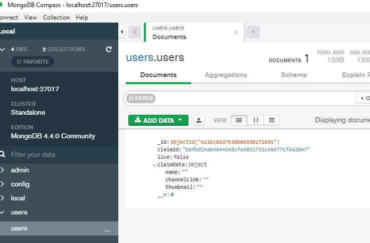

# Odysee-Discord-Live-Notification-Bot

This bot requires [MongoDB](https://docs.mongodb.com/manual/administration/install-community/)  
I recommend using your server provider on setting MongoDB up, here is DigitalOcean's [Guide](https://www.digitalocean.com/community/tutorials/how-to-install-mongodb-on-ubuntu-18-04-source)  

This is how the database would look with a user/claim id added to the users collection.  

I have included a default config.json that you will need to rename to 'config.json'.

In order to use the bot, type 'npm install' then 'nodemon' in the terminal or you can set it to run by itself 24/7 using [PM2](https://www.npmjs.com/package/pm2).